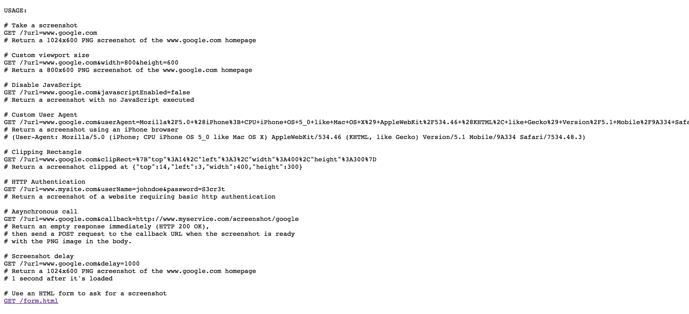

# NodeJS/PhantomJS Screenshot-As-A-Service

Fork of: [fzaninotto/screenshot-as-a-service](https://github.com/fzaninotto/screenshot-as-a-service)


## Getting Started

```sh
$ docker run -d -p 3000:3000 cage1016/screenshot-as-a-service
```

### Usage

> http://localhost:3000



### Screenshot example

> https://www.yahoo.co.jp/

